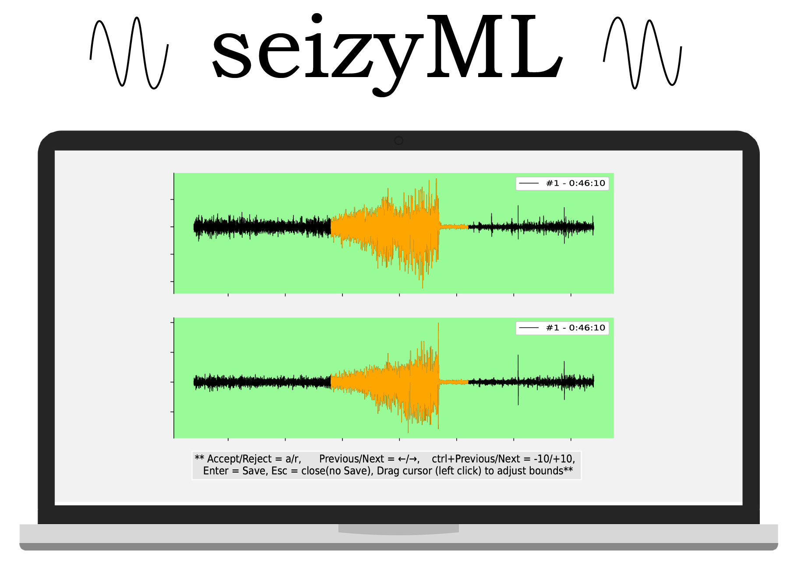
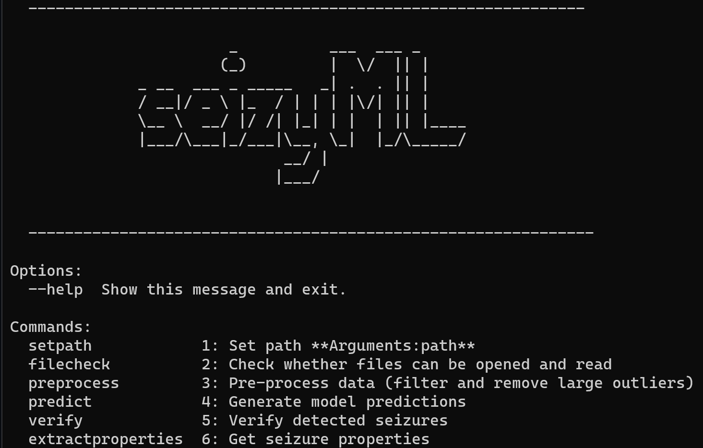
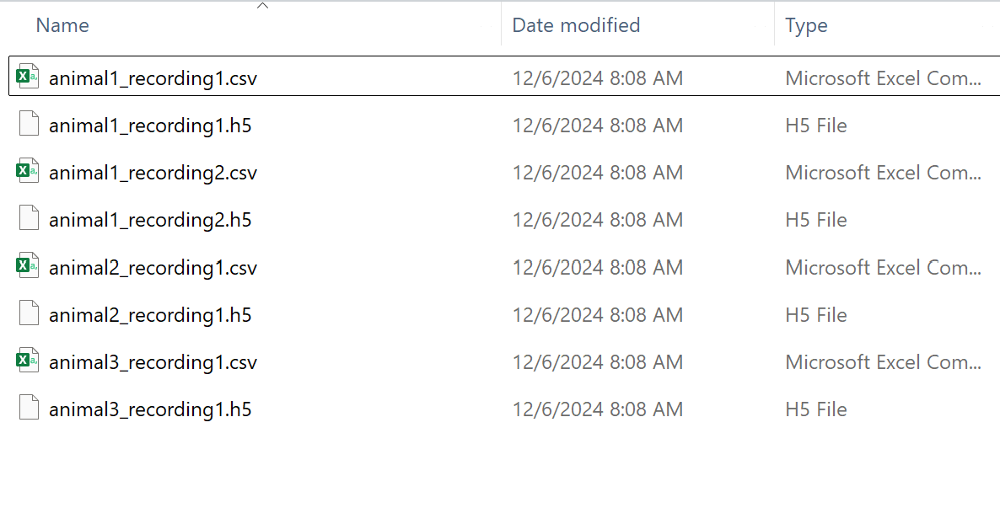
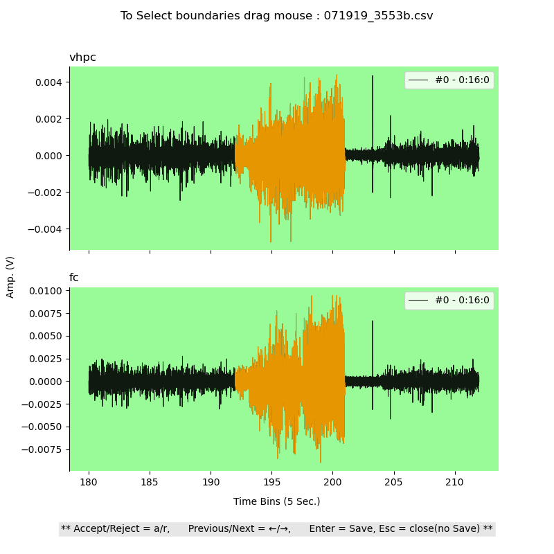

<p align="center">
        
</p>

- **SeizyML** uses interpretable machine learning models to detect 🕵️‍♂️ seizures from EEG recordings coupled with manual verification in user-friendly GUI.
- 📖 To reference **SeizyML**, or view the manuscript, please refer to the following [publication](https://www.researchsquare.com/article/rs-4361048/v1) (To be updated soon). 
- You can access the data and code used to reproduce the experiments and figures from the accompanying paper on [Zenodo](https://doi.org/10.5281/zenodo.14825785).


[](https://doi.org/10.5281/zenodo.14825785) 


---
## 📚 Contents
- ⚙️ [Hardware Requirements](hardware-requirements)
- 💾 [Installation](#installation)
- 📋 [How To Use](#how-to-use)
- 🛠️ [App Configuration](app-configuration)

### 📄 Additional Resources
- [Configuration settings](/docs/configuration.md)
- [SeizyML Processing Pipeline](/docs/model_pipeline.md)
- [Custom Model Integration](/docs/custom_model.md)
---

### Hardware requirements

- **SeizyML** is a lightweight application that utilizes Gaussian Naive Bayes (GNB) models to predict seizure events from EEG data.
- Any modern CPU with sufficient RAM to load your EEG recordings should work effectively.
- For example, a **quad-core CPU with 16 GB RAM** can efficiently handle 24-hour long EEG recordings with 2 channels sampled at 4000 Hz.
- **No GPU is required** for SeizyML's operation.
---

### Installation

#### Conda (Recommended)
1) Download and install [miniconda](https://repo.anaconda.com/miniconda/).
2) Clone or Download [SeizyML](https://github.com/neurosimata/seizy_ml/) on your machine.
3) Start Anaconda's prompt, navigate to the downloaded */seizy_ml* to create the conda environment:

        conda env create -f environment.yml

4) Activate environment

        conda activate seizyml

5) Launch App

        seizyml

#### Pip
1) Download and install [Python 3.9](https://www.python.org/downloads/release/python-390/).

2) In the terminal

        pip install seizyml

3) Launch App

        seizyml

If this works you should see the SeizyMl CLI interface.

<p align="center">
        
</p>

---  

### How To Use

#### 🚀  Quick Start Guide

```
# 1. Activate environment
conda activate seizyml

# 2. Train the model
seizyml train-model

# 3. Set data path
seizyml set-datapath /path/to/data

# 4. Preprocess EEG data
seizyml preprocess

# 5. Generate predictions
seizyml predict

# 6. Verify predictions via GUI
seizyml verify

# Repeat step 6 until all recordings are verified.

# 7. Extract seizure properties
seizyml extract-properties
```

---

#### 📄 Detailed instructions

1)  **Launch App.**

For conda:
```
# In anaconda prompt
conda activate seizyml
seizyml
```

For pip:
```
# In terminal
seizyml
```

2) **Train Model (Skip to step 3 if a model was trained).**
```
seizyml train-model
```
- You will be prompted to enter the full path to the training directory.
- This is the folder path where the training data in .h5 format along with the corresponding training labels in .csv format are stored.
- The training data consist of each recording in .h5 format **[Nsegments, 1 segment, Nchannels].** Where a segment is 500 (win*fs).
- For data conversion check the accompanying app [seizy_convert](https://github.com/neurosimata/seizy_convert) or the [h5_conversion script](/examples/to_h5.py) for more help.
- The training labels consist of a corresponding .csv file containing the  ground truth labels (1 for seizure, 0 for non seizure) with length **[Nsegments].**
- Training data and labels for each recording need to have a matching name.

<p align="center">
        
</p>

- After this a GUI will be launched to allow editing the settings.
- The only field that requires editing (given default formatting) is the `channels` field.
-         **channels** : List containing the names of LFP/EEG channels, e.g. ["hippocampus", "frontal cortex"]

3) **Set DataPath.**
```
seizyml set-datapath <data_path>
```

- The first is the full path to the parent directory where the child folder with h5 data resides and where all subsequent folders will be created. Check [configuration settings](/docs/configuration.md) for more information.
- The h5 data should be added in a child folder called `data`.
```
/parent_directory/
└── data/
    ├── file1.h5
    └── file2.h5
```
- The data need to be in the same format as the data used to train the model.

4) **Preprocess data.**

```
seizyml preprocess
```
- This is the step where the h5 data files will be filtered and large outliers will be removed.

5) **Generate model prections.**
```
seizyml predict
```
- Here selected features will be extracted and model predictions will be generated using the selected model (model id can be found in the configuration settings file).
- For more informtaion check the [model pipeline](/docs/model_pipeline.md)

6) **Verify seizures and adjust seizure boundaries.**
```
seizyml verify
```
- This will launch a prompt to allow for file selection for verification.
- After file selection, a GUI will be launched for seizure verification and boundary adjustment.
- Repeat this command until all files are verified

<p align="center">
        
</p>

7) **Get seizure properties.** 
```
seizyml extract-properties
```
- After all files are verified run this command to get seizure properties
- This step will generate a csv file with seizure properties for each h5 file.
- Current properties extracted per file are:

``` 
'seizure_number'
'avg_seizure_dur_sec'
'total_time_seizing_sec'
'coefficient_of_variation'
'recording_dur_hrs
```

----

### Other important functions

1) **Select Model.**
```
seizyml select-model <model_path> <user_settings_path>
```
- This function allows the user to select a model
- Before using **SeizyML** for seizure detection a model should be first trained on ground truth (hand-scored) data.

2) **Feature Contributions**
```
seizyml feature-contribution
```
- Features contribution to the GNB model can be visualized using the following command.

---

### App Configuration

All settings are stored in the `user_settings.yaml` file. 
- This file will be created in the training folder specified by the user when they run `seizyml train-model` command.
- To edit the `user_settings.yaml` use any text editor such as notepad:
- An explanation of all other settings can be found [here](/docs/configuration.md).
---

### 🤝 Contributions
We welcome all project contributions including raising issues and pull requests!

----

### 📬 Support

If you encounter issues, please submit them via the GitHub issue tracker.

----

-> Back to [Top](#-contents).
