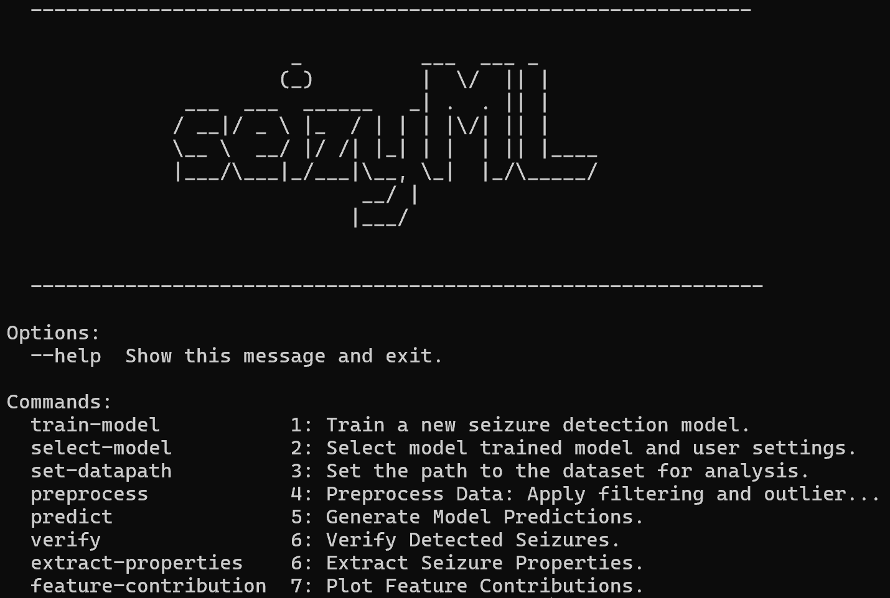

# SeizyML
:snake: **SeizyML** uses a simple gaussian naive bayes classifier to detect :detective: seizures from EEG recordings.
After the seizures are detected, they can be manually verified with a user-friendly GUI.

- Currently supports .h5 files as inputs.

---

### How to install
1) Download and install [miniconda](https://docs.conda.io/en/latest/miniconda.html) on your platform
2) Clone or Download [SeizyML](https://github.com/neurosimata/seizy_ml/)
3) Start Anaconda's shell prompt, navigate to */seizy_ml* and create conda environment:

        conda env create -f environment.yml
        
---

### Launch CLI

Via Anaconda's shell prompt

        # navigate to *seizy* folder
        cd ./seizy_ml
        
        # enter conda environment
        conda activate seizyml

        # Launch CLI
        python cli.py

---  

### Configuration settings and file preparation
For configuration settings and file preparation check the [configuration](docs/configuration.md) document.

---
        
### Tutorials
- Before using **SeizyML** for seizure detection a model should be first trained on ground truth (hand-scored) data.
- To train a model follow the guidelines in the [training](docs/training.md) tutorial.
- Check out here how you can use **SeizyML** for seizure detection [tutorial doc](docs/tutorial.md).

---
