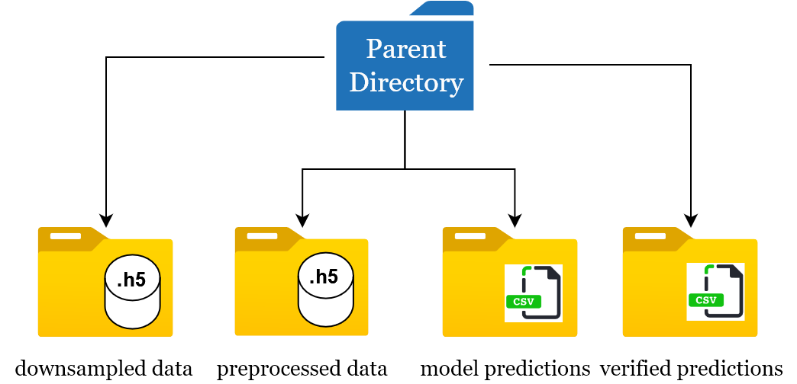

## Configuration settings

#### -> To be provided by user
- **parent_path** : path to parent directory, e.g. "C:\\Users\\...\\parent directory"
- **data_dir** : child directory name where .adicht files are present, default is "raw_data"
- **channels** : List containing the names of LFP/EEG channels, e.g. ["hippocampus", "frontal cortex"]
- **win** : window size in seconds, default and recommended is 5 seconds
- **fs** : sampling rate of .h5 files, default and recommended is 100 Hz

#### -> Created during app execution
- **processed_dir** : child directory name with h5 preprocessed data, default is "processed"
- **model_predictions_dir** : child directory name with model predictions are present (.csv), default is "model_predictions"
- **verified_predictions_dir** : child directory name where user verified predictions are present (.csv), default is "verified_predictions"

---
## Path organization

---

**[<< Back to Main Page](/README.md)**
